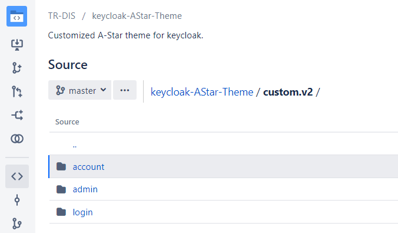
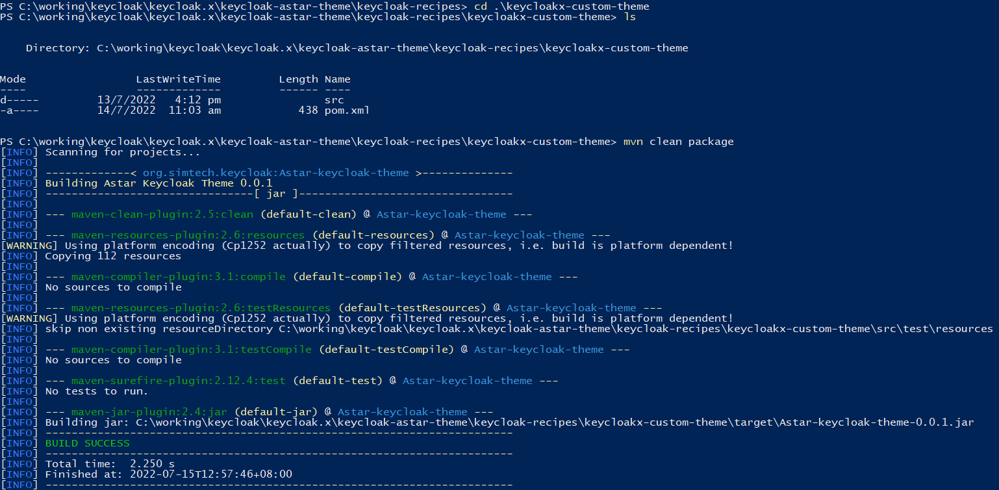
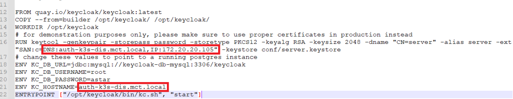
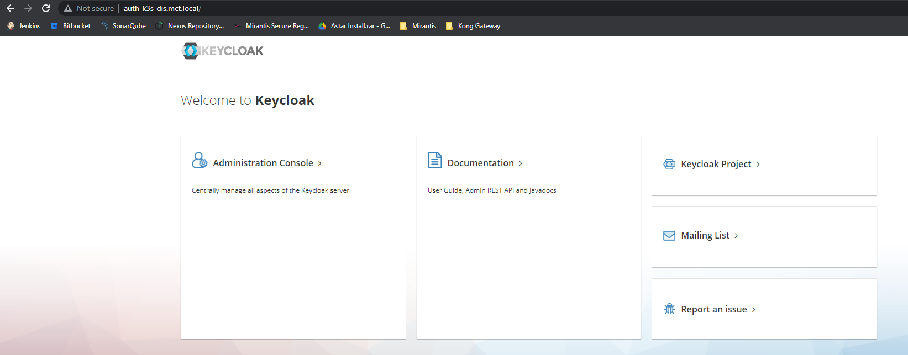

# Keycloak.x distribution deployment on Kubernetes

## Deploy external Mysql database

### Step 1: Create namespace keycloak for deployment if it does not exist

```
$ kubectl create ns keycloak
```

### Step 2: Deploy Mysql database using helm chart
Install  docker on all the hosts
```
helm repo add bitnami https://charts.bitnami.com/bitnami

helm install -n keycloak keycloak-db-mysql --set auth.rootPassword=astar,global.storageClass=managed-nfs-storage bitnami/mysql
```

### Step 3: Verify that the pod keycloak-db-mysql-0 is in running status.

```
mctadmin@st-mct-osme:~$ kubectl -n keycloak get pods
NAME                        READY   STATUS    RESTARTS       AGE
keycloak-db-mysql-0         1/1     Running   2 (29h ago)    2d1h

```

### Step 4: Deploy Mysql client pod to connect to Mysql database

```
kubectl run mysql-client --image=mysql:5.7 -it --rm --restart=Never -- /bin/bash
If you don't see a command prompt, try pressing enter.

//The root password is set during Mysql helm chart deployment in Step 2
bash-4.2# mysql -h keycloak-db-mysql -uroot -pastar
mysql: [Warning] Using a password on the command line interface can be insecure.
Welcome to the MySQL monitor.  Commands end with ; or \g.
Your MySQL connection id is 9284
Server version: 8.0.29 Source distribution

Copyright (c) 2000, 2022, Oracle and/or its affiliates.

Oracle is a registered trademark of Oracle Corporation and/or its
affiliates. Other names may be trademarks of their respective
owners.

Type 'help;' or '\h' for help. Type '\c' to clear the current input statement.
```

### Step 5: Create keycloak database

```
mysql> create database keycloak;
Query OK, 1 row affected (0.06 sec)

mysql> show databases;
+--------------------+
| Database           |
+--------------------+
| information_schema |
| keycloak           |
| my_database        |
| mysql              |
| performance_schema |
| sys                |
+--------------------+
6 rows in set (0.00 sec)
```

## Build customized theme jar file

### Step 1: Copy the css and js files from the bitbucket repository http://172.20.105.100:7990/scm/trdis/keycloak-astar-theme.git
to the directory keycloak.x\keycloak-recipes\keycloakx-custom-theme\src\main\resources\theme\astar.

For this tutorial, the css and js files are copied from below directory.



### Step 2: Build the jar file using Maven.
a. Go the directory below where a pox.xml file exists.
	keycloak.x\keycloak-astar-theme\keycloak-recipes\keycloakx-custom-theme
b. Open the Windows Powershell terminal in the directory.
c. Run the command "mvn clean package" to build the jar file.



d. Copy keycloak.x\keycloak-astar-theme\keycloak-recipes\keycloakx-custom-theme\target\Astar-keycloak-theme-0.0.1.jar to the
directory keycloak.x\keycloak-astar-theme\keycloak-recipes\keycloakx-custom-image where a Dockerfile locates.

### Step 3: Build the customized docker image.
a. Review the Dockerfile in the directory keycloak.x\keycloak-astar-theme\keycloak-recipes\keycloakx-custom-image to ensure
the hostname and database connection information is correct.



b. Build the docker image.

```
docker build -t 172.20.105.74/tr-dis/keycloak.x:v1 .
```

c. Upload the image to Mirantis image registry.

```
docker push 172.20.105.74/tr-dis/keycloak.x:v1
```

## Deploy Keycloak.x service
### Step 1. Go to the directory keycloak.x\keycloak-astar-theme\k8s-manifests
### Step 2. Apply the manifest files.
```
kubectl -n keycloak apply -f deploy.yaml
kubectl -n keycloak apply -f svc.yaml
kubectl -n keycloak apply -f ingress.yaml
```

### Step 3. Verify that the keycloak pod is in running status.
```
mctadmin@st-mct-osme:~$ kubectl -n keycloak get pods
NAME                        READY   STATUS    RESTARTS       AGE
mysql-client                1/1     Running   1 (2d6h ago)   2d6h
keycloak-6749ffb7fc-c6x9q   1/1     Running   0              43h
keycloak-db-mysql-0         1/1     Running   2 (35h ago)    2d7h
mctadmin@st-mct-osme:~$ kubectl -n keycloak-x get ingress
NAME       CLASS    HOSTS                    ADDRESS          PORTS   AGE
keycloak   <none>   auth-k3s-dis.mct.local   172.20.105.105   80      2d3h
```
### Step 4. Update hostname in DNS server or host file locally.
### Step 5. Access keycloak admin page through ingress.

